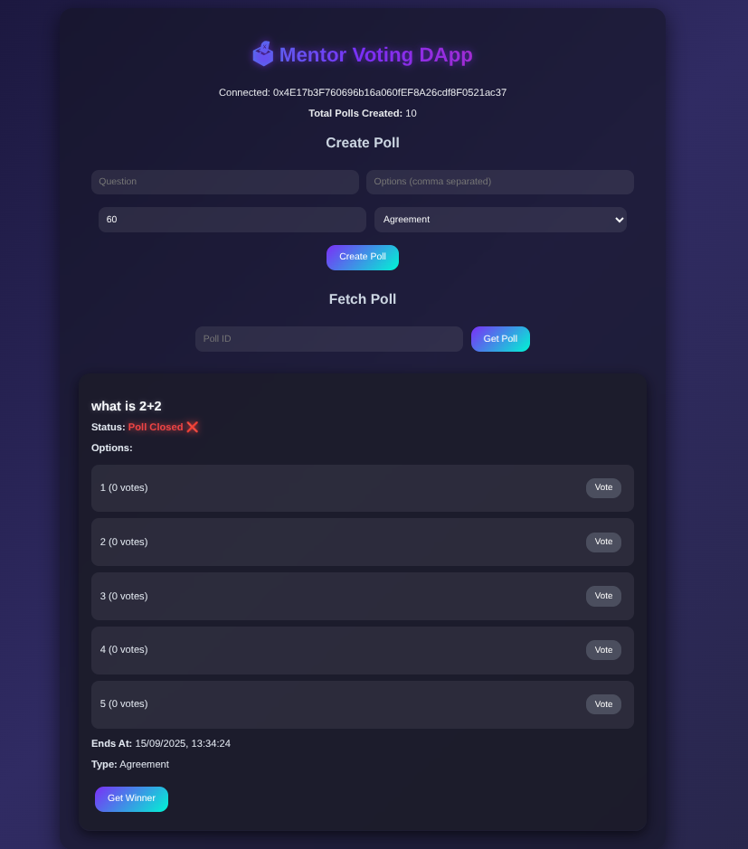

# 🗳 Mentor Voting DApp

A decentralized voting application built with **React + Ethers.js** that allows users to create, share, and vote on polls. The app interacts with a **MentorVoting smart contract** deployed on Ethereum-compatible networks.

---

## ✨ Features

- 🔗 Connect your MetaMask wallet  
- ➕ Create new polls with:
  - Question  
  - Multiple options  
  - Duration (in seconds)  
  - Poll type (Agreement / Quiz)  
- 📤 Share poll links directly with others  
- 📥 Fetch poll details by poll ID  
- 🗳 Vote on active polls  
- 🏆 Declare and view poll winners  
- ⏳ Live poll status (Active ✅ / Closed ❌)  
- 🎨 Ambient glassmorphism UI  

---

## 🌐 Live Demo

👉 [Mentor Voting DApp](https://mentor-voting-dapp.vercel.app/)  

---

## 🛠️ Tech Stack

- **Frontend:** React, Ethers.js  
- **Smart Contract:** Solidity (MentorVoting contract)  
- **Blockchain:** Ethereum / Compatible EVM Network  
- **Wallet:** MetaMask  

---

## 🚀 Getting Started

### 1. Clone the repository
<git clone https://github.com/HemeshKanyal/mentor-voting-dapp.git>
<cd MENTOR-VOTING-DAPP>

##  Install dependencies

<npm install>

## Run the development server
<npm start>

The app will be available at http://localhost:3000

Smart Contract Details

Contract Address: 0x85CbbaF6AC0A7565540f7aF9082e419816689C00

Key Functions:

createPoll(string, string[], uint256, uint8, uint256)

vote(uint256, uint256)

getPoll(uint256)

getWinner(uint256)

pollCount()

## UI Preview

The DApp uses a glassmorphism + ambient gradient theme for a smooth modern interface.

## License

This project is licensed under the MIT License.